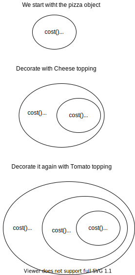
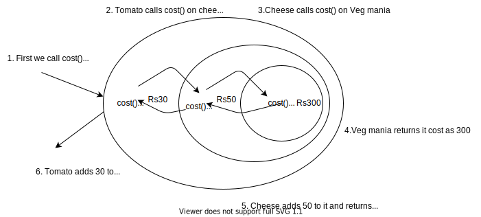

# Decorator Pattern

The __decorator pattern__ attaches additional responsibilties to an object dynamically. 
Decorators provide a flexible alternative to subclassing for extending functionality.

Let's understand this with an example. Let's say we are at a Pizza shop. 
The shop has various pizza's and each pizza can be loaded with several toppings.
For example we can have a Veg Mania Pizza with double cheese and tomato topping.
Now each kind of pizza has a cost and similarly each kind of topping has a cost.
So in order to find the total cost of the ordered pizza, we need to add all these costs and return.

One way to do this is to create classes for all combination of pizza. But then we will have to create an
enormous amount of classes. 

One more approach would be to add instance variables of toppings in the pizza class and based on the order
set those values and calculate the cost. Problem with this is that changes in toppings will lead to changes
in existing classes. This is a violation of __Open Closed Principle__.

Here our decorator pattern comes in play. 
We can take a pizza, decorate it with cheese and again decorate it with tomato.

### Working

We see that the decorator class, i.e, toppings mirrors (has the same type as) the component object, i.e, pizza.  

The `cost()` method is called on the outermost decorator. It delegates the call to the object it wraps.
This goes on till the call reaches the component and it returns a cost. 
Then all decorators add their cost. 

__Class Diagram__

### Salient Features

- Decorators have the same type as the objects they decorate.
- We can wrap an object with one or more decorators.
- The decorator adds its own behaviour either before or after delegating to the object it decorates to do the rest of the job.
- Objects can be decorated dynamically at runtime.
