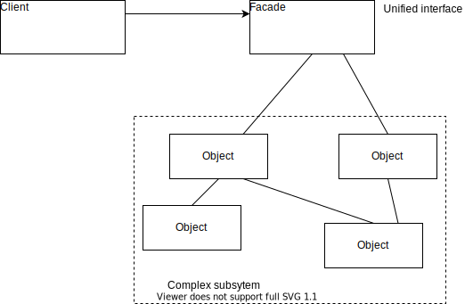

# Facade Pattern

The Facade Pattern provides a unified interface to a set of interfaces in a subsytem.
Facade defines a higher level interface that makes the subsystem easier to use.
It also decouples the client from a subsystem of components.

__Class Diagram__

Both facade and adapter may wrap multiple classes.
The different lies in their intent. 
The intent of the Adapter Pattern is to alter an interface so that it matches one a client is expecting.
The intent of the Facade Pattern is to provide a simplified interface to a subsystem.

### Problem Statement

You have a marriage to arrange, i.e., book hotels, set flowers etc.
This is a lot to do by oneself.
Hence, you ask an event manager to arrange the marriage.
