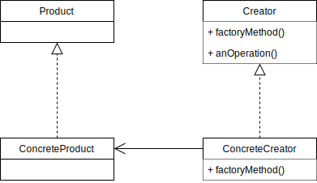
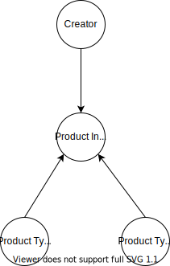

# Factory Pattern

We would like to tie the object creator and the client together but still be flexible.
Hence, we introduce the __Factory Method__ which handles object creation and encapsulates it in a subclass. 
This decouples the client code in the superclass from the object creation code in the subclass.

__Class Diagram__

- The `Creator` class defines an interface for creating an object, but lets subclasses decide which class to instantiate.
- The `ConcreteCreator` class implements the `factoryMethod()` which is responsible for creating the concrete product.
- All products implement the same interface so that the classes which use the products can refer to the interface, not the concrete class.

### The Dependency Inversion Principle

__Depend upon abstractions. Do not depend upon concrete classes.__

It suggests that our high-level components should not depend on our low-level components; rather, they should both depend on abstractions.

We can apply this to the Factory Method as follows:

The creator class depends on the product interface.
The concrete Product class also depend on the product interface as they implement it.

### Problem Statement

Let's say we want to create profile on different social networking sites like Facebook, Linkedin.
Now all these sites will have different sections for ex: Facebook will have an album section while Linkedin will have an achievement section and they both will have a personal information section.
We need to create the profile with the right sections.
