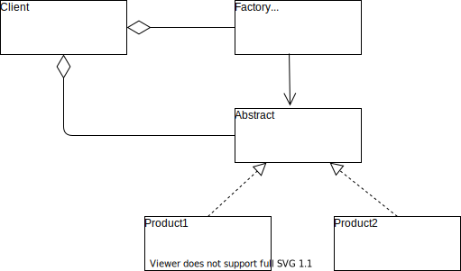

# Simple Factory Pattern

__Simple factory pattern__ encapsulates the task of creating objects into a different class.
Object creation segment deals with _which concrete class to be instantiated_ and this segment changes the most, as compared to the segment which is coded to an interface.
Hence, its better to separate the object creation part from the rest of the code.

__Class Diagram__

### Problem Statement

Let's say we have an Animal class which has a method `speak`.
Now we need to create a Forest class which based on the animal provided as input makes the sound of the animal.
