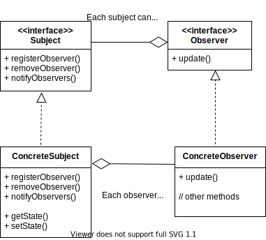

# OBSERVER PATTERN

The observer pattern can be visualized as a newspaper subscription service. We have a newspaper publisher which publishes newspapers and there are several people which are subscribed to that publisher. All the customers who are subscribed receive the newspaper, new customers can subscribe anytime and existing customers can unsubscribe when they dont want the newspaper to get delivered. Observer Pattern is pretty much the same, here the publisher is the __subject__ and the subscribers are the __observers__.

The __observer pattern__ defines a one-to-many dependency between objects so that when one object changes state, all of its dependents are notified and updated equally.

__Class Diagram__

Salient points:
- We can see that the subject and observer are loosely coupled. The subject does need to know about the concrete observer. It just knows that all observers are going to implement the same interface.
- We can add/remove observers at runtime.
- When adding/removing observers, we dont need to modify code of subject.

### Pull Model

- The subject broadcasts to all registered observers when there is any change.
- The observer is responsible for getting the changes or pulling data from the subject when there is an update.
- In this case we send an instance of the subject as paramaeter in the `update()` method. The observer can pull the data using the subject object.

### Push Model

- Unlike pull model, the subject pushes the changes to the observer.
- In the code you can see `update()` taking a string parameter `news`. That parameter is the data which is changed.
- This is not preferred when data is large.
